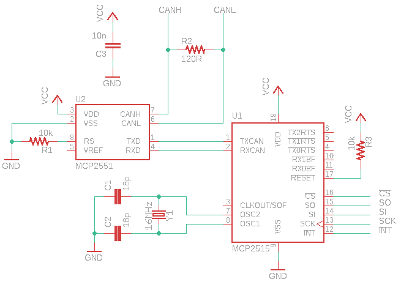

# Flatpack2
Software, hardware and protocol information for the Eltek Flatpack2.

Provided is [a simple voltage changing Arduino sketch](Arduino/fp2_set_voltage/).

Check [Protocol.md](https://github.com/The6P4C/Flatpack2/blob/master/Protocol.md) for information about the CAN bus protocol used by the Flatpack2.

# Transceiver + Breakout Board

